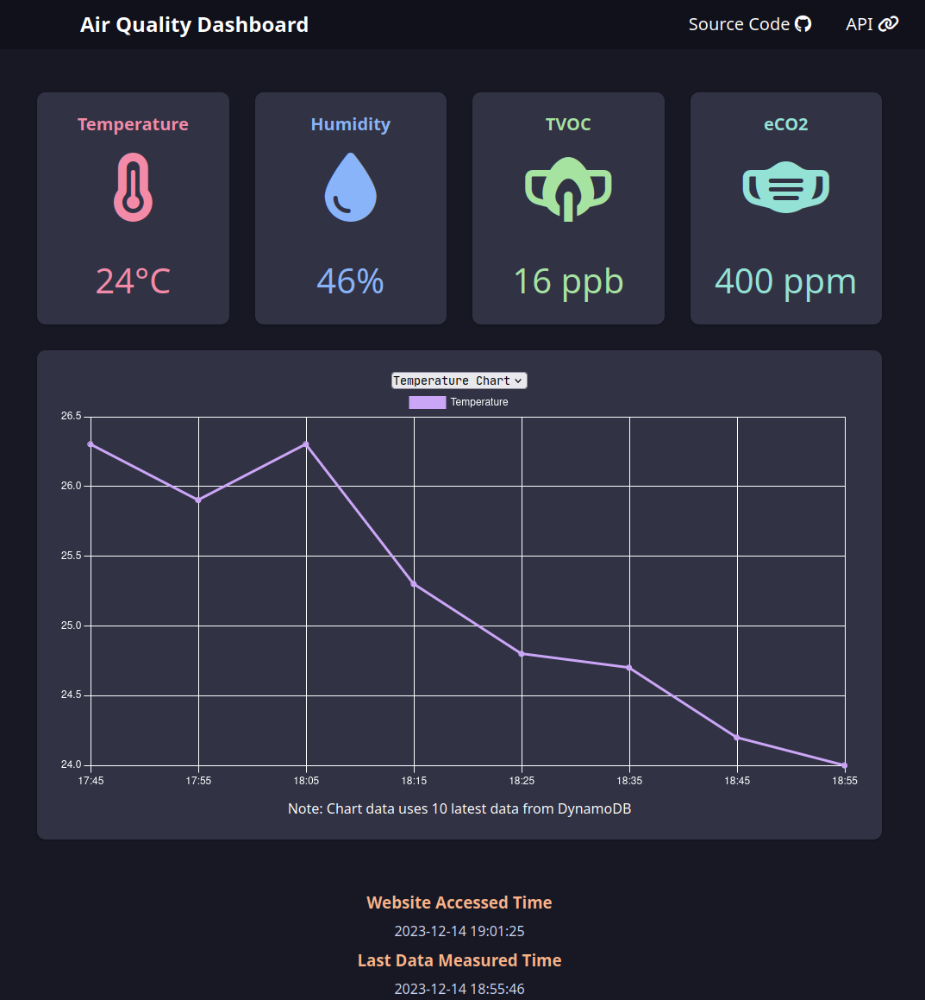
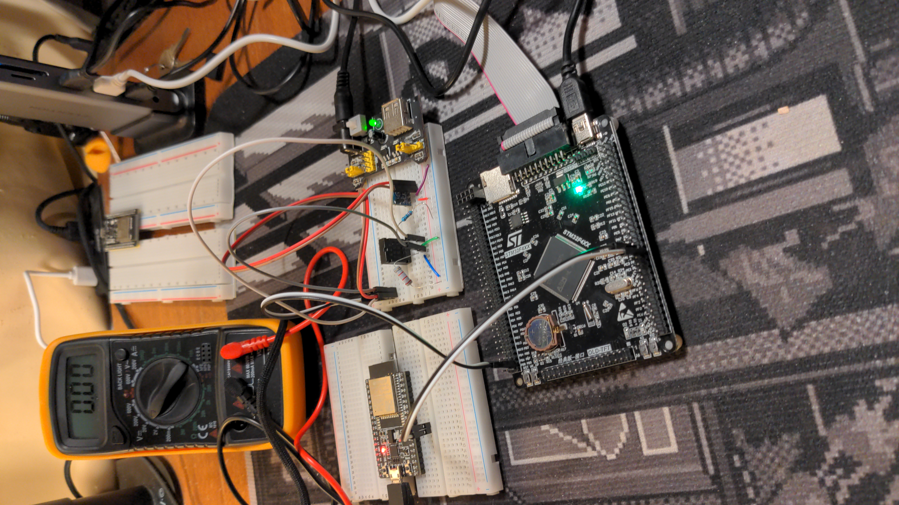
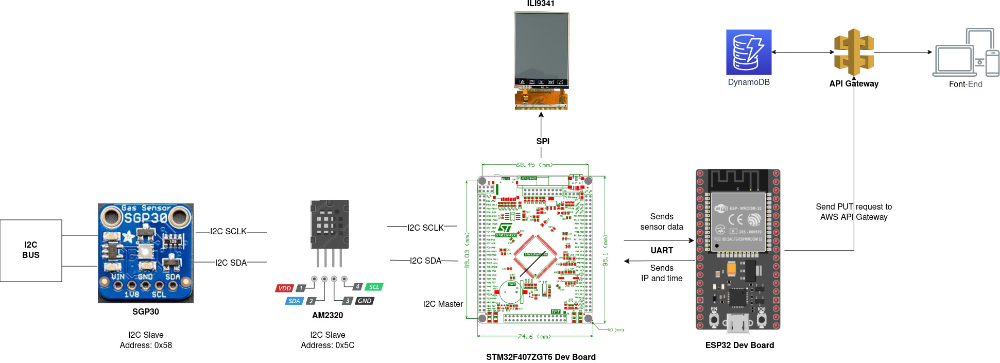

# IoT-Air-Quality-Monitoring
An Internet of Things (IoT) air quality monitoring project that measures the temperature, humidity, TVOC, and CO2 of a room and sends the data to AWS DynamoDB backend and a [simple front-end to display data](https://airqualitydashboard.jyydev.xyz/).

Hardware uses STM32, ESP32, and some sensors (see below for more details). Dashboard is [here](https://airqualitydashboard.jyydev.xyz/).


## Project Preview






## Project Architecture Overview



STM32 collects both sensors' data via I2C connection and then sends data through UART to ESP32. ESP32 then packages data into JSON and sends JSON data to HTTP server. ESP32 also sends its own IP address and current time to STM32. Using all data gathered, STM32 displays data to LCD through SPI.


Backend uses DynamoDB with API Gateway and Lambda proxy integration. Lambda uses NodeJS. Front-End is a simple HTML, CSS, Javascript that fetches and displays data using the API.

## Hardware Overview
- MCU: STM32F407ZGT6 and ESP32
- Air Quality Sensor: SGP30 (I2C)
- Temperature and Humidty sensor: AM2320 (I2C)
- LCD: ILI9341 (SPI)
<!-- - Wireless Module: ESP-01 (UART) -->

## Todo
- [x] Will eventually store sensor data in some database (most likely Postgresql) on a VPS and develop some REST API to view past data. Then I will develop a simple front-end using API to show data nicely (could show in graphs or other ways).

Completed, see [this](https://github.com/jamesyoung-15/IoT-Home-Sensor-Dashboard) project.

## Hardware Pin Connections

### STM32
|   Pin |   Connected To    |       Notes                       |
|-------|-------------------|-----------------------------------|
|   A2  |   ESP32 Pin 16    | USART (ESP32) Rx <-> Tx (STM32)   |
|   A3  |   ESP32 Pin 17    | USART (ESP32) Tx <-> Rx (STM32)   |
|   B6  |   AM2320 & SGP30  | I2C SCDA  |
|   B7  |   AM2320 & SGP30  | I2C SCLCLK  |
|   A5  |   ILI9341         | SPI SCK |
|   A7  |   ILI9341         | SPI MOSI |
|   C4  |   ILI9341         | SPI CS |
|   C5  |   ILI9341         | ILI9341 Reset |
|   B0  |   ILI9341         | ILI9341 DC |


### ESP32
|   Pin |   Connected To    |       Notes                       |
|-------|-------------------|-----------------------------------|
|   16  |   STM32 Pin A2    | USART (ESP32) Rx <-> Tx (STM32)   |
|   17  |   STM32 Pin A3    | USART (ESP32) Tx <-> Rx (STM32)   |

## Development Tools/Workflow
- OS: Linux (Arch)
- IDE: VSCode
    - For STM32
        - Extensions:
            - C/C++ Intellisense
            - Cortex-Debug
            - Makefile
    - For ESP32
        - Arduino CLI
            - Libraries:
                - ArduinoJSON
                - Arduino ESP32 Libraries
    - AWS
        - Lambda (NodeJS), API Gateway, DynamoDB
    - Front-End
        - HTML, CSS, JS
- Other Tools:
    - For STM32:
        - OpenOCD
        - Arm GNU Toolchain (gcc-arm-none-eabi, etc.)
        - CubeMX (generating code and libraries)
        - Make


## Notes
### Documentations
- [SGP30 Datasheet](https://www.mouser.com/pdfdocs/Sensirion_Gas_Sensors_SGP30_Datasheet_EN-1148053.pdf)
- [AM2320 Datasheet](https://cdn-shop.adafruit.com/product-files/3721/AM2320.pdf)
<!-- - [ESP-01 AT Commands](https://docs.espressif.com/projects/esp-at/en/release-v2.2.0.0_esp8266/AT_Command_Set/index.html) 
(Note this is for V2.1 which contains some newer commands like MQTT that won't work with older versions) -->
- [ESP32 Arduino Library Usage](https://docs.espressif.com/projects/arduino-esp32/en/latest/getting_started.html)
- [ILI9341](http://www.lcdwiki.com/res/MAR2808/ILI9341_Datasheet.pdf)
    - ILI9341 code based on [LCD Wiki provided demo codes](http://www.lcdwiki.com/2.8inch_IPS_SPI_Module_ILI9341)

### STM32 Terminal and VSCode Usage Reminders
Add something similar to below to end of Makefile (make sure to change target to correct MCU). Then can just use `make build` to make and flash program into MCU.
``` C 
flash: all
    openocd -f interface/stlink.cfg -f target/stm32f4x.cfg -c "program $(BUILD_DIR)/$(TARGET).elf verify reset exit"
```

Remember to include other files to compile in Makefile. Eg:
``` C

C_SOURCES =  \
Core/Src/main.c \

// ... Other files to compile ...

// Below example of own files
modules/am2320.c \
modules/sgp30.c \
modules/esp01.c
```

For VSCode Intellisense make sure to add include paths. Eg:
``` json
"includePath": [
                "${workspaceFolder}/**",
                "${workspaceFolder}/STM32F407ZGT6/Core/Inc",
                "${workspaceFolder}/STM32F407ZGT6/Drivers/STM32F4xx_HAL_Driver/Inc",
                "${workspaceFolder}/STM32F407ZGT6/Drivers/CMSIS/Device/ST/STM32F4xx/Include",
                "${workspaceFolder}/STM32F407ZGT6/Drivers/CMSIS/Include",
                "${workspaceFolder}/STM32F407ZGT6/Drivers/CMSIS/Core/Include",
                "${workspaceFolder}/STM32F407ZGT6/Drivers/CMSIS/Core_A/Include",
                "${workspaceFolder}/STM32F407ZGT6/Drivers/CMSIS/DSP/Include",
                "${workspaceFolder}/STM32F407ZGT6/modules"
                
]
```
### Other Notes
Tested on STM32F407 and STM32F103 boards. Also I have included support for ESP-01 but only for UDP transmissions. Had to use ESP32 for HTTP since don't know why I cannot establish a working TCP server with ESP-01 as it always hangs on AT+CIPSEND, but my code has worked on another development board in the past with built-in ESP-01 (see [my STM32 robot car project](https://github.com/jamesyoung-15/Mini-Robot-Cleaner)).
